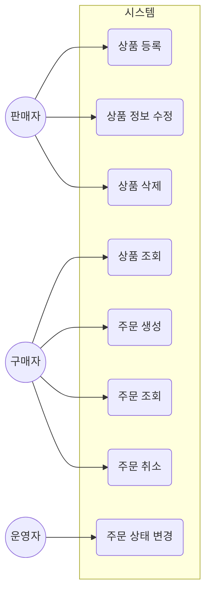

# User Story

## 유즈케이스 다이어그램

## Epic 1. 상품 관리 (판매자)

### US-1.1 상품 등록

**As a** 판매자
**I want** 상품을 등록하고 싶다
**So that** 등록한 상품을 구매자에게 노출할 수 있다

**Acceptance Criteria**
- 상품명, 가격 등 기본 정보를 입력해 상품을 등록할 수 있다
- 등록 직후 상품은 "판매중" 상태로 노출된다

### US-1.2 상품 조회

**As a** 구매자
**I want** 상품을 단건 또는 목록으로, 판매 상태별로 조회하고 싶다
**So that** 원하는 상품을 찾을 수 있다

**Acceptance Criteria**
- 상품 상세 정보를 단건으로 조회할 수 있다
- 판매중 / 품절 / 판매종료 상태로 필터링해 목록을 조회할 수 있다
- 삭제된 상품은 목록/조회 결과에 노출되지 않는다

### US-1.3 상품 정보 수정

**As a** 판매자
**I want** 상품의 가격, 재고, 판매 상태를 수정하고 싶다
**So that** 최신 판매 조건을 반영할 수 있다

**Acceptance Criteria**
- 가격/재고/판매 상태를 변경할 수 있다
- 이미 삭제된 상품은 수정할 수 없다

### US-1.4 상품 삭제

**As a** 판매자
**I want** 더 이상 팔지 않는 상품을 삭제하고 싶다
**So that** 구매자에게 더 이상 노출되지 않게 할 수 있다

**Acceptance Criteria**
- 삭제한 상품은 상품 목록/조회에서 더 이상 보이지 않는다
- 과거에 그 상품을 주문했던 이력은 삭제 후에도 정상적으로 조회된다

---

## Epic 2. 주문 관리 (구매자)

### US-2.1 주문 생성

**As a** 구매자
**I want** 원하는 상품을 담아 주문하고 싶다
**So that** 상품을 구매할 수 있다

**Acceptance Criteria**
- 상품과 수량을 선택해 주문을 생성할 수 있다
- 주문 생성 직후 상태는 "주문 접수"로 표시된다
- 재고보다 많은 수량을 주문하면 주문이 생성되지 않고, 재고가 부족하다는 안내를 받는다
- 동시에 여러 주문이 들어와도 재고가 실제 수량보다 더 많이 팔리지 않는다

### US-2.2 주문 조회

**As a** 구매자
**I want** 내가 주문한 내역을 단건 또는 상태별로 조회하고 싶다
**So that** 주문 진행 상황을 확인할 수 있다

**Acceptance Criteria**
- 주문 상세(담긴 상품 정보 포함)를 조회할 수 있다
- 주문 상태별로 목록을 필터링해 조회할 수 있다
- 주문이 많아져도 목록 조회 속도가 느려지지 않는다

### US-2.3 주문 취소

**As a** 구매자
**I want** 아직 배송이 시작되지 않은 주문을 취소하고 싶다
**So that** 실수로 만든 주문을 되돌릴 수 있다

**Acceptance Criteria**
- "주문 접수" 또는 "결제 완료" 상태에서만 취소할 수 있다
- 이미 배송이 시작된 이후에는 취소할 수 없고, 안내 메시지를 받는다
- 취소한 주문의 상품은 다시 구매 가능한 재고로 복원된다

---

## Epic 3. 주문 상태 관리 (운영자)

### US-3.1 주문 상태 변경

**As a** 운영자
**I want** 주문 상태를 진행 단계에 맞게 변경하고 싶다
**So that** 구매자에게 정확한 배송 진행 상황을 안내할 수 있다

**Acceptance Criteria**
- 주문 상태는 "주문 접수 → 결제 완료 → 배송중 → 배송 완료" 순서로만 진행된다
- 순서를 건너뛰거나 거꾸로 되돌리는 변경은 거부되고, 이유가 안내된다
